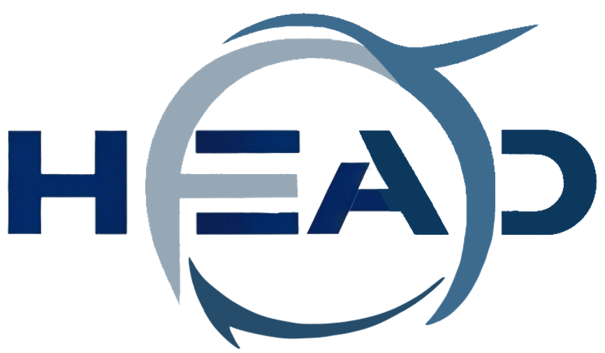
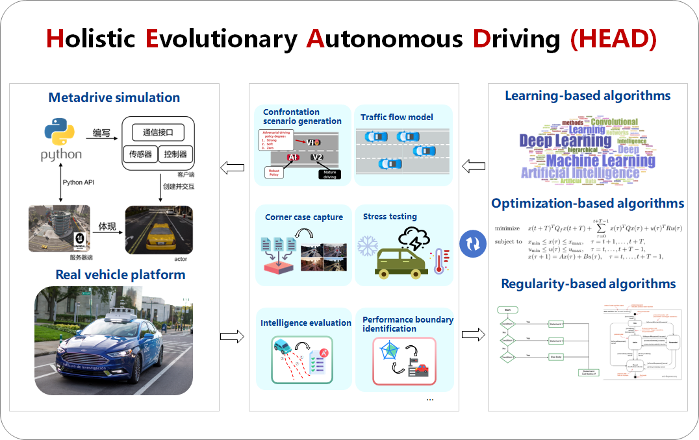
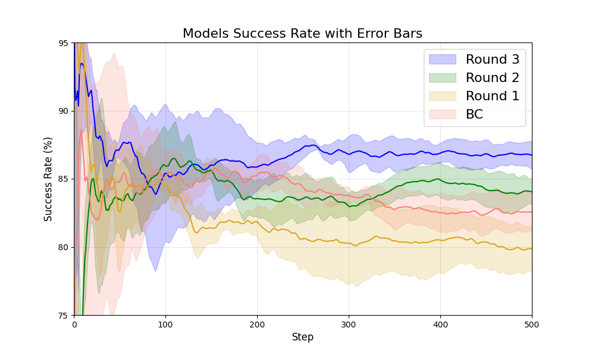
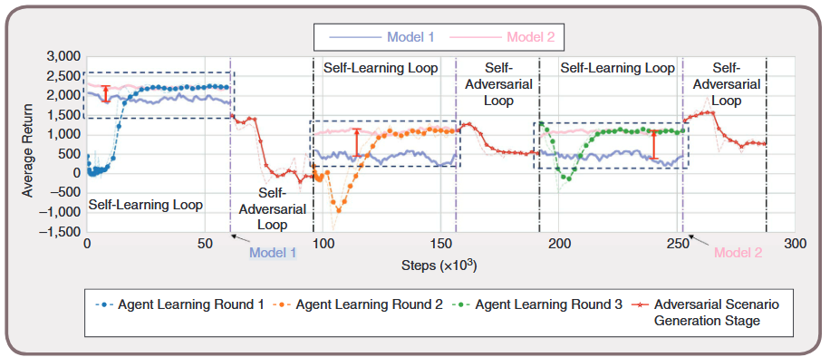

# HEAD:Holistic Evolutionary Autonomous Driving
HEAD is a holistic suite of evolutionary autonomous driving software, based on the MetaDrive simulation platform, that seamlessly imports driving scenarios, uploads training models, and efficiently performs continuous training designed to significantly improve the performance of arbitrary models.
## Introduction
**HEAD (Holistic Evolutionary Autonomous Driving)** is an Autonomous Driving Platform with the following key features: 
- **A General Self-Evolutionary Autonomous Driving Software Tool**: It combines learning-based, optimization-based, and rule-based algorithms to efficiently handle complex driving scenarios and ensure safety and performance.
- **Integration with Simulation Testing**: It is deeply integrated with the MetaDrive simulation platform, enabling comprehensive testing and optimization.
- **A Closed-Loop Data-Driven Platform**: It provides a complete closed-loop system from scenario generation to algorithm evolution, enhancing adaptability and reliability in unseen scenarios through adversarial testing and continuous learning.

## 🔧Quick Start
1. **Clone the repo**

   Start by cloning the HEAD repository to your local machine:
    ``` bash
    git clone https://github.com/TJHuangteam/HEAD.git
    cd HEAD
   ```
2. **Conda Env Settings and Install Dependencies**
    ``` bash
    conda create -n HEAD python=3.9
    conda activate HEAD
    pip install -r requirements.txt
    ```
   
## Adversarial Loop
The adversarial loop refers to a training framework where adversarial examples or environmental perturbations are introduced to improve the robustness and generalization ability of a model. 
\
Adversarial loops are commonly used in reinforcement learning and security research to enhance an agent's adaptability to uncertain and harsh environments.
1. **Enter Adversarial Loop**
   ```bash
   cd ./HEAD/adversarial_loop
   ```
2. **Launch Basic Experiment**
   ```bash
   python training_main.py
   ```

## Algorithmic Evolution Loop

The algorithmic evolution loop is based on the Dynamic Progressive Optimization Framework, 
which supports the progressive optimization and continuous adaptation of expert agents through data aggregation 
and multi-expert strategy distillation. 
The framework first uses reinforcement learning to generate diverse cross-scenario datasets, 
accumulating strategy knowledge through trial and error. 
Subsequently, a continual learning model incrementally trains the data using imitation learning, 
incorporating new scenarios and datasets. By embedding sub-expert models and a gating mechanism within the constant learning, 
the framework enables adaptive strategy learning and optimization across scenarios. 
Ultimately, the framework generates expert agents capable of making efficient decisions and demonstrating long-term adaptability.

**Enter Algorithmic Evolution Loop**

```bash
cd ./HEAD/adversarial_evolution_loop
```

**Training Reinforcement learning Experts**

```
python SAC_muti_scenario_con.py
```

**Launch Continual Model**

```bash
python train.py
```

**Evaluate the Model**

``` bash
python eval_in_env.py
```

This is the PyTorch implementation for training and evaluating the project. The project mainly includes training files, testing files, and model files.
` train.py`  is used to train the constant learning model implemented in this project. `train_benchmark.py` is used to train the models for comparison experiments. Using ` train.py`  as an example, the following are important parameter settings during training:

--` model_path` : Path to save checkpoints
\
--` layers` : Number of layers per task
\
--` sizes` Input/output size of the model
\
--` task_n_epochs` : Number of epochs for round n training
\
--` data_paths` : Paths to the training dataset

Evaluation eval_in_env.py is used to evaluate the trained model in MetaDrive:
\
--` expert_num` : Number of experts in the trained model
\
--` layers` : Number of layers per task
\
--` sizes` : Input/output size of the model
\
--` model_path` : Full path to the model checkpoint to be evaluated
\
--` eval_eps` : Number of evaluation episodes
\
--` render` : Use 1 to enable window visualization, 0 to disable

Model ` ConstantLearning.py`  is the specific implementation of the model.

## Self-Learning Loop
A self-learning loop is an unsupervised learning strategy where the model learns through self-supervision. 
\
The self-training loop is commonly used in scenarios with limited labeled data or high annotation costs, such as image classification and natural language processing.
1. **Enter Self-Learning Loop**
   ```bash
   cd ./HEAD/self-learning_loop
   ```
   
2. **Real Scenario Reproduction**
   ```bash
   cd ./scenario_reproduction
   ```
   1. Convert the recorded bag files from the actual vehicle to csv files
   \
   PS: Please note your ROS version
   `rostopic echo -b input.bag -p /output > output.csv`
   2. In **obj_info.py**, load your bag file, extract vehicle and pedestrian information, and store it as an **obj_info.pkl** file.
   3. Load the map osm file, and in **osm_scenario.py**, extract road information and save in **map_features.pkl**.
   4. In **run_main.py**, load vehicle and pedestrian information **obj_info.pkl** and  map lane information **map_features.pkl**, integrate the information into  `ScenarioDescription` format for reproduction in metadrive, and save in the `dataset/`.
   5. If you'd like to visualize the transferred scenario, please run:
      ```bash
      python -m scenarionet.sim -d /path_to_your scenario_reproduction/dataset --render 2D/3D
      ```
3. **Launch Basic Experiment**

   Run **SAC\_multi\_scenario\_con.py**
\
Set the `--database_path` to processed dataset for training and evaluation.
\
This file is the main function for training and evaluating the reinforcement learning agent.
\
The training and testing process can be viewed online via tensorboard:
`tensorboard --logdir = /path_to_your_model/test`
\
PS: You can also load public datasets such as waymo, nuscenes, nuplan(which need to be processed by scenarionet's convert to a unified format)
## Typical Experiments Result

### Algorithmic Evolution Loop

The experimental results demonstrate that the **Algorithmic Evolution Loop**, powered by Constant Learning, 
significantly improves the performance of autonomous driving systems. 
By leveraging gradual optimization, dynamic expansion of the expert network, and adaptive mechanisms, this loop enables the system to effectively handle complex and edge cases. 
Through iterative learning from new failure cases and continuous adaptation in dynamic environments, the loop drives rapid model evolution, leading to enhanced performance and robustness over time.


#### HEAD Evolution Experiment

The experimental results on the **HEAD** platform demonstrate a significant improvement in autonomous driving system performance in complex and uncertain scenarios.
Through the three-round self-learning loop, the agent’s rewards steadily increased, showcasing its ability to adapt progressively to challenging environments. 
In contrast, during the self-adversarial loop, the reward notably decreased, highlighting the effectiveness of adversarial scenarios in uncovering system weaknesses and driving further evolution. 
Models trained over multiple rounds outperformed those trained in a single self-learning round, validating the superiority of this iterative self-evolution mechanism. 
These findings confirm that **HEAD Evolution** paradigm enhances the intelligence and adaptability of autonomous driving systems.


## References

If you use HEAD in your own work, please cite:
```text
@article{yang2024guarantee,
  title={How to guarantee driving safety for autonomous vehicles in a real-world environment: a perspective on self-evolution mechanisms},
  author={Yang, Shuo and Huang, Yanjun and Li, Li and Feng, Shuo and Na, Xiaoxiang and Chen, Hong and Khajepour, Amir},
  journal={IEEE Intelligent Transportation Systems Magazine},
  year={2024},
  publisher={IEEE}
}
```


## Acknowledgements

Github:[GitHub - metadriverse/metadrive: MetaDrive: Open-source driving simulator](https://github.com/metadriverse/metadrive)

Website:[MetaDrive | MetaDriverse](https://metadriverse.github.io//metadrive/)


``` text
@article{li2021metadrive,
  title={MetaDrive: Composing Diverse Driving Scenarios for Generalizable Reinforcement Learning},
  author={Li, Quanyi and Peng, Zhenghao and Xue, Zhenghai and Zhang, Qihang and Zhou, Bolei},
  journal={arXiv preprint arXiv:2109.12674},
  year={2021}
}
```


## Relevant Projects

**Metadrive: Composing diverse driving scenarios for generalizable reinforcement learning**
\
Li, Quanyi and Peng, Zhenghao and Feng, Lan and Zhang, Qihang and Xue, Zhenghai and Zhou, Bolei
\
*IEEE Transactions on Pattern Analysis and Machine Intelligence*
\
[
<a href="https://arxiv.org/pdf/2109.12674.pdf">Paper</a>
|
<a href="https://metadriverse.github.io/metadrive-simulator/">Website</a>
|
<a href="https://github.com/metadriverse/metadrive">Code</a>
]


## License

All assets and code are under the [Apache 2.0 license](./LICENSE) unless specified otherwise.


