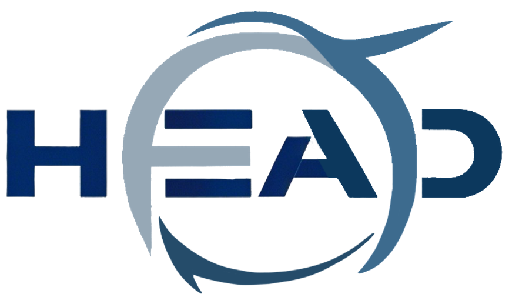
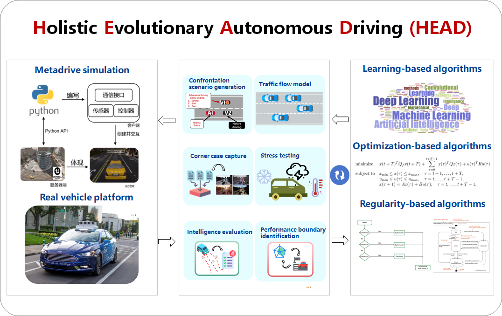

# HEAD:Holistic Evolutionary Autonomous Driving
HEAD is a holistic suite of evolutionary autonomous driving software, based on the MetaDrive simulation platform, that seamlessly imports driving scenarios, uploads training models, and efficiently performs continuous training designed to significantly improve the performance of arbitrary models.
## Introduction
**HEAD (Holistic Evolutionary Autonomous Driving)** is an Autonomous Driving Platform with the following key features: 
- **A General Self-Evolutionary Autonomous Driving Software Tool**: It combines learning-based, optimization-based, and rule-based algorithms to efficiently handle complex driving scenarios and ensure safety and performance.
- **Integration with Simulation Testing**: It is deeply integrated with the MetaDrive simulation platform, enabling comprehensive testing and optimization.
- **A Closed-Loop Data-Driven Platform**: It provides a complete closed-loop system from scenario generation to algorithm evolution, enhancing adaptability and reliability in unseen scenarios through adversarial testing and continuous learning.

## 🔧 Quick Start

The commands below are the tested, minimal setup for the MetaDrive environments and
the RLBoost examples. Linux, Python 3.9--3.11, a C++ compiler and (for rendering)
an X11-capable display are recommended. A GPU is optional for basic usage.

1. **Clone the repository**

   ```bash
   git clone https://github.com/XingZuoMuYe/HEAD.git
   cd HEAD
   ```

2. **Create and activate a virtual environment**

   `uv venv` must target a directory that does not replace the repository itself.

   ```bash
   python3 -m pip install --upgrade uv
   uv venv --python 3.9 .venv
   source .venv/bin/activate
   export LD_LIBRARY_PATH=
   export CUDA_HOME=
   uv pip install -r requirements.txt
   ```

   `requirements.txt` installs the core MetaDrive and RLBoost dependencies. Optional
   Waymo and UniTraj dependencies are not included.

3. **PyTorch/CUDA compatibility**

   `requirements.txt` pins the PyTorch 2.5.0 CUDA 12.1 build used by this
   project. Do not mix it with a NATTEN or PyTorch wheel built for another CUDA
   version. CPU-only environments should replace the three PyTorch packages with
   matching CPU wheels before running the project.

4. **Optional: extract the bundled scenario archives**

   These archives are only required for `real_scenario-v0`. Run from the repository
   root; `unzip` creates the destination directories and is safe to rerun.

   ```bash
   unzip -o head/scenario_datasets/geely.zip -d head/scenario_datasets/
   unzip -o head/scenario_datasets/waymo.zip -d head/scenario_datasets/
   ```

5. **Optional: build the local planner C++ extension**

   The Python planner works without this extension. On Debian/Ubuntu, install Eigen3,
   pybind11 and CMake, then build from the repository root:

   ```bash
   sudo apt-get update
   sudo apt-get install -y build-essential cmake libeigen3-dev pybind11-dev
   cmake -S head/policy/evolvable_policy/common/local_planner \
         -B head/policy/evolvable_policy/common/local_planner/build \
         -DCMAKE_BUILD_TYPE=Release
   cmake --build head/policy/evolvable_policy/common/local_planner/build \
         --parallel
   ```

6. **Configure and run the project**

   Keep `LD_LIBRARY_PATH=` and `CUDA_HOME=` in the environment when launching the
   project, especially on machines with ROS or a system CUDA installation. The
   default configuration selects Poly on the generated straight-road scenario.
   It does not require UniTraj; Poly uses its automatic checkpoint directory and
   falls back to random actions when no trained run exists.

   ```bash
   export LD_LIBRARY_PATH=
   export CUDA_HOME=
   python -m head.scripts.main_head
   ```

   Configuration is split by responsibility:

   - `runtime`: random seed and device selection
   - `simulation`: vectorization, rendering, and environment sizing
   - `workflow.type`: lifecycle selection (`deploy` or `evolution`)
   - `workflow.policy`: one of four peer policies (`IDM`, `Poly`, `Zero`, or `imitation`)
   - `workflow.evolution`: evolution strategy and learner
   - `workflow.policies`: per-policy checkpoints and imitation settings
   - `evaluation`: closed-loop mode, episode count, interval, and video output
   - `logging`: external experiment tracking
   - `artifacts`: separate roots for evolution weights, imitation weights, logs, and evaluation outputs
   - `task`: choose `straight_config_traffic-v0`, `single_scenario-v0`,
     `multi_scenario-v0`, or `real_scenario-v0`
   - `scenario`: task-specific map and dataset values loaded from `configs/tasks`
   - `scenario.capabilities`: task capabilities used for compatibility validation

   Values can be overridden without editing YAML, for example:

   ```bash
   python -m head.scripts.main_head simulation.render=false runtime.device=auto
   ```

   Evaluation is intentionally fixed to closed-loop interaction:

   ```yaml
   evaluation:
     mode: closed_loop
     episodes: 1
     max_steps: 400
     save_video: false
   ```

   `evaluation.mode` must remain `closed_loop`; changing it is rejected during
   configuration validation.

   IDM is one of the four peer policies in the deploy workflow:

   ```yaml
   task: straight_config_traffic-v0
   workflow:
     type: deploy
     policy: IDM
   ```

   Both workflow types accept the same policy set. `deploy` executes or
   evaluates the selected policy, while `evolution` attaches the configured
   evolution learner.

   `IDM` and `Zero` run directly as rule policies. Poly defaults to the
   automatically resolved directory
   `artifacts/weights/evolution/RLBoost/SAC/<task>/<map>/<train_name>/`.
   If that directory contains `sac_policy`, it is loaded; otherwise Poly warns
   and uses `action_space.sample()`. Evolution checkpoints are stored at
   `artifacts/weights/evolution/<strategy>/<learner>/<task>/<map>/<train_name>/`.

   For convenience, `workflow.type=IDM`, `workflow.type=Poly`,
   `workflow.type=Zero`, and `workflow.type=imitation` are accepted as
   shorthand deploy commands and are normalized to the schema above.

   All policy-specific values belong under `workflow.policies`; only the
   selected policy is validated. Relative paths are resolved from the project
   root:

   ```yaml
   workflow:
     type: deploy
     policy: Poly
     policies:
       Poly:
         checkpoint: auto
       imitation:
         model: wayformer
         source: ../UniTraj_benchmark_sample
         checkpoint: artifacts/weights/imitation/wayformer/model.ckpt
   ```

   | Workflow | Allowed policies |
   | --- | --- |
   | `deploy` | `IDM`, `imitation`, `Poly`, `Zero` |
   | `evolution` | `IDM`, `imitation`, `Poly`, `Zero` |

   Before selecting imitation learning, install the benchmark-specific packages
   and its bundled ScenarioNet package:

   ```bash
   export UNITRAJ_ROOT=/path/to/UniTraj_benchmark_sample
   uv pip install lightning pytorch-lightning hydra-core easydict einops h5py torch-geometric
   uv pip install -e "$UNITRAJ_ROOT/scenarionet"
   ```

   Point `workflow.policies.imitation.source` at the
   external UniTraj benchmark root (the directory containing `unitraj/`) and
   place the Wayformer checkpoint at
   `artifacts/weights/imitation/wayformer/brier_fde=1.45.ckpt`. The legacy
   `head/policy/imitation_policy/checkpoints/` location is still accepted. HEAD then runs
   ego-only closed-loop control: it warms
   up from recorded history, replans periodically, and converts the predicted
   trajectory to MetaDrive steering and throttle actions with PID control.

   ```bash
   export LD_LIBRARY_PATH=
   export CUDA_HOME=
   uv run python -m head.scripts.main_head \
     task=real_scenario-v0 \
     workflow.type=deploy \
     workflow.policy=imitation \
     workflow.policies.imitation.source="$UNITRAJ_ROOT" \
     workflow.policies.imitation.checkpoint=brier_fde=1.45.ckpt \
     runtime.device=auto \
     simulation.render=false
   ```

   `imitation` is only accepted when the selected task configuration
   declares `scenario.capabilities.closed_loop_imitation: true`. Generated-road
   tasks declare this capability as false and are rejected before environment
   creation.

   Every closed-loop evaluation writes results to
   `artifacts/eval/closed_loop/<policy>/<task>/<map>/metrics.json`. Each episode
   records reward, length, collision, out-of-road, destination arrival, and
   success. The aggregate also contains `collision_rate`, `out_of_road_rate`,
   `arrive_dest_rate`, and `success_rate`.

   For `real_scenario-v0`, the same file additionally contains UniTraj's
   `EvaluateMetrics` values: `no_collision`, `area_compliance`,
   `direction_compliance`, `ttc`, `speed_compliance`, `progress`, `comfort`,
   and `total_score`. These metrics are independent of video rendering. Other
   tasks still produce the generic closed-loop safety summary without requiring
   a UniTraj checkout.

   During evaluation, the key values are printed as they are collected:

   ```text
   [闭环] Episode:1 Reward:43.037 Length:80 Collision:False OutOfRoad:False ArriveDest:True Success:1
   [闭环指标] total_score:0.641 no_collision:1.000 ttc:1.000 progress:0.538 comfort:0.000
   [闭环汇总] Episodes:1 MeanReward:43.037 SuccessRate:1.000 CollisionRate:0.000 OutOfRoadRate:0.000 ArriveDestRate:1.000
   ```

   HEAD evaluation is always environment-stepped closed-loop evaluation; there
   is no offline/open-loop evaluation entry point in `main_head.py`. The complete
   policy matrix is valid. Only the selected policy is validated:

   | Workflow | IDM | Zero | Poly | imitation |
   | --- | --- | --- | --- | --- |
   | `deploy` | rule policy | rule policy | checkpoint or random action | UniTraj checkpoint |
   | `evolution` | SAC | SAC | SAC | SAC + UniTraj |

   For `deploy + Poly`, an empty `workflow.policies.Poly.checkpoint` prints a
   warning and uses `action_space.sample()`. For `evolution + IDM/Zero/Poly`, an
   empty policy checkpoint means random initialization. `pluto` is reserved in
   the configuration but currently rejected as not implemented.

7. **Run the automated tests**

   ```bash
   export LD_LIBRARY_PATH=
   export CUDA_HOME=
   pytest -q
   ```

   The test suite validates configuration parsing and performs a reset/step of the
   default MetaDrive environment.

## References

If you use HEAD in your own work, please cite:
```text
@article{yang2024guarantee,
  title={How to guarantee driving safety for autonomous vehicles in a real-world environment: a perspective on self-evolution mechanisms},
  author={Yang, Shuo and Huang, Yanjun and Li, Li and Feng, Shuo and Na, Xiaoxiang and Chen, Hong and Khajepour, Amir},
  journal={IEEE Intelligent Transportation Systems Magazine},
  year={2024},
  publisher={IEEE}
}
```


## Acknowledgements

This project integrates and builds upon the following excellent open-source works:

- MetaDrive Simulation:
  - GitHub: https://github.com/metadriverse/metadrive
  - Website: https://metadriverse.github.io/metadrive/

- ScenarioNet:
  - GitHub: https://github.com/metadriverse/scenarionet

- UniTraj (Unified Trajectory Forecasting Framework):
  - GitHub: https://github.com/vita-epfl/UniTraj
  - Paper: https://arxiv.org/abs/2403.15098

We gratefully acknowledge their contributions to the autonomous driving and imitation learning communities.


``` text
@article{li2021metadrive,
  title={MetaDrive: Composing Diverse Driving Scenarios for Generalizable Reinforcement Learning},
  author={Li, Quanyi and Peng, Zhenghao and Xue, Zhenghai and Zhang, Qihang and Zhou, Bolei},
  journal={arXiv preprint arXiv:2109.12674},
  year={2021}
}
```


## Relevant Projects

**Metadrive: Composing diverse driving scenarios for generalizable reinforcement learning**
\
Li, Quanyi and Peng, Zhenghao and Feng, Lan and Zhang, Qihang and Xue, Zhenghai and Zhou, Bolei
\
*IEEE Transactions on Pattern Analysis and Machine Intelligence*
\
[
<a href="https://arxiv.org/pdf/2109.12674.pdf">Paper</a>
|
<a href="https://metadriverse.github.io/metadrive-simulator/">Website</a>
|
<a href="https://github.com/metadriverse/metadrive">Code</a>
]

## License

All assets and code are under the [Apache 2.0 license](./LICENSE) unless specified otherwise.

## Project Structure

The repository is organized around configuration, environment construction,
policy selection, and closed-loop evaluation. Generated checkpoints, logs, and
metrics are kept under `artifacts/` and are not source files.

```text
HEAD/
├── head/
│   ├── configs/                 # default.yaml and per-task YAML files
│   ├── envs/                    # generated and recorded MetaDrive environments
│   ├── evolution_engine/        # environment builder and RLBoost/SAC
│   ├── manager/
│   │   ├── config_manager.py    # config merge and validation
│   │   ├── evolution_selector.py
│   │   ├── artifact_paths.py    # checkpoint and output resolution
│   │   └── closed_loop_metrics.py
│   ├── policy/
│   │   ├── basic_policy/        # IDM and Zero
│   │   ├── evolvable_policy/    # Poly and local planner
│   │   └── imitation_policy/    # UniTraj inference and controller
│   ├── renderer/
│   └── scripts/main_head.py     # closed-loop entry point
├── tests/                      # configuration, environment, policy, metrics tests
├── artifacts/                  # generated eval/closed_loop, logs, and weights
├── assets/                     # figures and project images
├── requirements.txt
├── README.md
└── LICENSE
```

The detailed tree below is a legacy snapshot retained for reference; the
top-level structure above is authoritative.

<details>
<summary>Legacy generated tree</summary>

```text
├.
├── artifacts
│   ├── eval
│   │   └── RLBoost_SAC
│   │       ├── muti_scenario
│   │       │   └── XCO
│   │       ├── real_scenario
│   │       │   └── real
│   │       ├── single_scenario
│   │       │   ├── interaction
│   │       │   └── roundabout
│   │       └── straight_config_traffic
│   │           └── straight_road
│   ├── logs
│   │   └── RLBoost_SAC
│   │       ├── muti_scenario
│   │       │   └── XCO
│   │       │       └── wandb_info
│   │       ├── real_scenario
│   │       │   └── real
│   │       │       └── wandb_info
│   │       ├── single_scenario
│   │       │   ├── interaction
│   │       │   │   └── wandb_info
│   │       │   └── roundabout
│   │       │       └── wandb_info
│   │       └── straight_config_traffic
│   │           └── straight_road
│   └── models
│       └── RLBoost_SAC
│           └── checkpoints
│               ├── muti_scenario
│               │   └── XCO
│               ├── real_scenario
│               │   ├── geely
│               │   ├── real
│               │   └── waymo
│               ├── single_scenario
│               │   ├── circle_road
│               │   ├── inRamp
│               │   ├── interaction
│               │   └── roundabout
│               └── straight_config_traffic
│                   ├── straight_road
│                   └── straight_road_no_pedestrian
├── assets
│   ├── closed_loop_structure.jpg
│   ├── experiment_2.jpg
│   ├── experiment.jpg
│   ├── HEAD-icon.jpg
│   ├── HEAD.jpg
│   └── HEAD-structure.png
├── debug
│   └── head_debug.py
├── geely
├── head
│   ├── component
│   │   ├── map
│   │   │   ├── custom_light_manager.py
│   │   │   ├── custom_map_manager.py
│   │   │   └── lane_utils.py
│   │   └── navigation
│   │       └── custom_navigation.py
│   ├── configs
│   │   ├── default.yaml
│   │   └── tasks
│   │       ├── default.yaml
│   │       ├── muti_scenario.yaml
│   │       ├── real_scenario.yaml
│   │       ├── single_scenario.yaml
│   │       └── straight_config_traffic.yaml
│   ├── envs
│   │   ├── config_traffic_metadrive_env.py
│   │   ├── __init__.py
│   │   ├── multi_scenario_metadrive_env.py
│   │   └── real_scenario_metadrive_env.py
│   ├── evolution_engine
│   │   ├── common
│   │   │   ├── __init__.py
│   │   │   ├── memory.py
│   │   │   ├── model.py
│   │   │   ├── multiprocessing_env.py
│   │   │   ├── plot.py
│   │   │   ├── running_mean_std.py
│   │   │   └── utils.py
│   │   ├── env_builder
│   │   │   ├── env.py
│   │   │   └── __init__.py
│   │   ├── __init__.py
│   │   └── RLBoost
│   │       ├── __init__.py
│   │       └── SAC
│   │           ├── agent.py
│   │           ├── cfg.py
│   │           ├── __init__.py
│   │           ├── logger.py
│   │           ├── model.py
│   │           └── SAC_learner.py
│   ├── __init__.py
│   ├── manager
│   │   ├── base_algorithm_selector.py
│   │   ├── bev_img_manager
│   │   │   └── bev_img_manager.py
│   │   ├── config_manager.py
│   │   ├── config_pedestrain_manager.py
│   │   ├── config_traffic_manager.py
│   │   ├── evolution_engine.py
│   │   ├── evolution_selector.py
│   │   └── __init__.py
│   ├── policy
│   │   ├── basic_policy
│   │   │   ├── idm_policy_include_pedestrian.py
│   │   │   ├── idm_policy_with_osm.py
│   │   │   └── __init__.py
│   │   ├── evolvable_policy
│   │   │   ├── common
│   │   │   │   ├── cfgs
│   │   │   │   │   └── config.yaml
│   │   │   │   ├── config.py
│   │   │   │   ├── __init__.py
│   │   │   │   ├── local_planner
│   │   │   │   │   ├── 编译命令.txt
│   │   │   │   │   ├── CMakeLists.txt
│   │   │   │   │   ├── cubic_spline_planner.py
│   │   │   │   │   ├── frenet_optimal_trajectory.py
│   │   │   │   │   ├── __init__.py
│   │   │   │   │   ├── setup.py
│   │   │   │   │   ├── spline_utils.pyx
│   │   │   │   │   └── util.cpp
│   │   │   │   ├── low_level_controller
│   │   │   │   │   ├── controller.py
│   │   │   │   │   └── __init__.py
│   │   │   │   ├── tools
│   │   │   │   │   ├── __init__.py
│   │   │   │   │   ├── misc.py
│   │   │   │   │   └── utils.py
│   │   │   │   └── utils.py
│   │   │   ├── __init__.py
│   │   │   └── poly_planning_policy.py
│   │   └── __init__.py
│   ├── pyproject.toml
│   ├── renderer
│   │   ├── head_renderer.py
│   │   └── top_down_renderer.py
│   ├── scenario_datasets
│   │   ├── geely.zip
│   │   └── waymo.zip
│   ├── scenario_reproduction
│   │   ├── __init__.py
│   │   └── rosbag_pkl
│   │       ├── data_convert.py
│   │       ├── __init__.py
│   │       ├── README.md
│   │       └── util
│   │           ├── dataset_summary.py
│   │           ├── GNSS_info_process.py
│   │           ├── GNSS_Transform.py
│   │           ├── __init__.py
│   │           ├── obj_info.py
│   │           ├── osm_scenario.py
│   │           └── raw_data
│   │               ├── scenario_1
│   │               ├── scenario_2
│   │               ├── scenario_3
│   │               ├── scenario_4
│   │               └── scenario_5
│   └── scripts
│       ├── __init__.py
│       └── main_head.py
├── LICENSE
├── README.md
├── requirements.txt
├── start_train.sh
├── tests
│   ├── drive_in_real_env.py
│   ├── env_render_plot.py
│   ├── map.jpg
│   └── run_env.py
└── waymo

```

</details>
